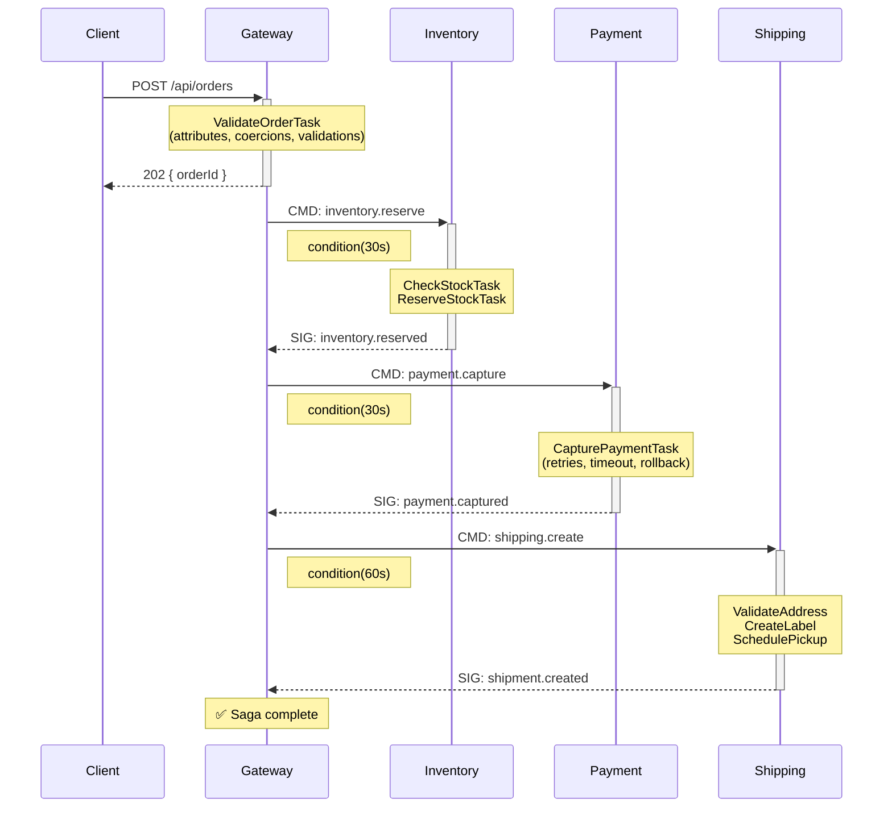
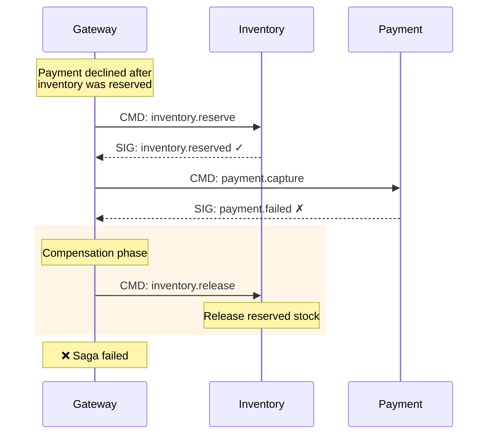
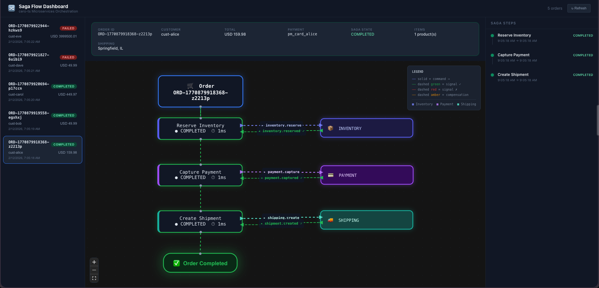
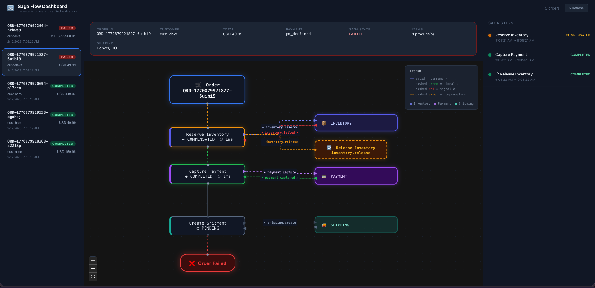

# Microservices Saga — Durable Workflow Orchestration with cero-ts

A complete microservices example demonstrating the **Centralized Durable Workflow/Orchestrator pattern** using **cero-ts** Interactive Workflows, **RabbitMQ** for messaging, and **SQLite** (`node:sqlite`) for per-service persistence.

## Why a Durable Orchestrator?

This example implements the architecture that best balances long-running steps, retries/compensations, observability, auditability, and operational simplicity:

| Principle | How it's implemented |
| -------- | -------- |
| **Explicit state + durable history** | Every saga step is persisted to `saga_steps` SQLite table BEFORE commands are dispatched and AFTER signals arrive. Single source of truth for where an order is in the pipeline. |
| **Built-in retry + backoff** | cero-ts `retries` with `retryJitter` on the `CapturePaymentTask`. Configurable per-task. |
| **Formalized compensations** | `COMPENSATION_REGISTRY` maps each step to its compensating action. The orchestrator runs compensations deterministically and records results. |
| **Long-running task support** | `condition()` blocks the workflow without tying up threads or resources. Survives minutes-long waits for external services. |
| **Observability + debugging** | `saga_steps` table + `saga_events` audit trail + SSE live dashboard = single workflow view showing step-by-step progress, failures, retries, and timestamps. |
| **Crash recovery** | On startup, the gateway detects incomplete sagas from `saga_steps`, runs compensations for completed steps, and marks them as failed. No data loss. |
| **Idempotent steps** | Every service handler checks if a command was already processed before executing. Retried commands produce the same result. |
| **Flexible latency** | `POST /api/orders` returns `202 Accepted` immediately; the saga continues asynchronously. Status is queryable in real-time. |

---

## Architecture

```text
┌────────────────────────────────────────────────────────────────────────┐
│                         Docker Compose                                 │
│                                                                        │
│   ┌──────────────┐    ┌────────────────────────────────────────────┐   │
│   │  RabbitMQ    │    │  API Gateway (:3000)                       │   │
│   │  :5672       │◄──►│  Hono + OrderSagaWorkflow                  │   │
│   │  :15672 (UI) │    │  Signal Router + Event Collector           │   │
│   └──────┬───────┘    │  SQLite: orders.db                         │   │
│          │            └────────────────────────────────────────────┘   │
│          │                                                             │
│   ┌──────┼──────────────────────────────────────────────────────────┐  │
│   │      │                                                          │  │
│   │  ┌───▼───────────┐  ┌────────────────┐  ┌────────────────────┐  │  │
│   │  │ Payment       │  │ Inventory      │  │ Shipping           │  │  │
│   │  │ Service       │  │ Service        │  │ Service            │  │  │
│   │  │ payments.db   │  │ inventory.db   │  │ shipments.db       │  │  │
│   │  └───────────────┘  └────────────────┘  └────────────────────┘  │  │
│   └─────────────────────────────────────────────────────────────────┘  │
│                                                                        │
└────────────────────────────────────────────────────────────────────────┘
```

### Saga Flow



### Compensation on Failure

If any step fails or times out, the saga automatically runs compensating transactions:



| Failure Point | Compensation |
| -------- | -------- |
| Inventory reservation fails | None needed |
| Payment fails (after inventory reserved) | Release inventory |
| Shipping fails (after payment captured) | Refund payment + release inventory |

---

## Prerequisites

- **Docker** and **Docker Compose** v2+
- **Node.js 24+** (for local development without Docker)
- **npm 10+**

---

## Quick Start

### With Docker (recommended)

```bash
cd examples/microservices-saga
docker compose up --build
```

This starts 5 containers:

- **RabbitMQ** — `amqp://localhost:5672`, Management UI at <http://localhost:15672> (guest/guest)
- **Gateway** — <http://localhost:3000>
- **Payment**, **Inventory**, **Shipping** — headless RabbitMQ consumers

### Local Development (without Docker)

Requires a running RabbitMQ instance at `amqp://localhost:5672`.

```bash
# Install dependencies
cd examples/microservices-saga
npm install

# Start each service in separate terminals
RABBITMQ_URL=amqp://localhost:5672 npm run dev:gateway
RABBITMQ_URL=amqp://localhost:5672 npm run dev:payment
RABBITMQ_URL=amqp://localhost:5672 npm run dev:inventory
RABBITMQ_URL=amqp://localhost:5672 npm run dev:shipping
```

### Demo Script

The included `run-demo.sh` automates the full stack lifecycle — starts services, creates orders, polls for completion, and prints a summary.

```bash
# 1 happy-path order (default)
./run-demo.sh

# 5 diverse orders
./run-demo.sh --orders 5

# Mixed scenarios: 3 happy + 1 declined card + 1 out-of-stock
./run-demo.sh --mix

# Clean databases first, then run mixed demo
./run-demo.sh --clean --mix
```

<details>
<summary><strong>Example output</strong> (<code>./run-demo.sh --mix</code>)</summary>

```text
▸ Mix mode: creating 5 orders (3 happy + 1 declined card + 1 out-of-stock)

═══ Creating 5 demo order(s) ═══

▸ Order 1/5 — cust-alice (Springfield, IL)
✔ Created ORD-1770880478528-j2hcna
▸ Order 2/5 — cust-bob (Portland, OR)
✔ Created ORD-1770880479651-yirv6b
▸ Order 3/5 — cust-carol (Austin, TX)
✔ Created ORD-1770880480817-3ogl3q
▸ Order 4/5 — cust-dave (Denver, CO) [declined card]
✔ Created ORD-1770880482046-cvk4xt
▸ Order 5/5 — cust-eve (Seattle, WA) [out-of-stock]
✔ Created ORD-1770880483185-8enlan

═══ Waiting for sagas to complete ═══

  ORD-1770880478528-j2hcna
    └─ ✔ saga completed

  ORD-1770880479651-yirv6b
    └─ ✔ saga completed

  ORD-1770880480817-3ogl3q
    └─ ✔ saga completed

  ORD-1770880482046-cvk4xt
    └─ ✖ saga failed

  ORD-1770880483185-8enlan
    └─ ✖ saga failed

═══ Summary ═══

▸ Orders created: 5

  ORD-1770880478528-j2hcna
    status: completed    steps: ✓ inventory_reserve  ✓ payment_capture  ✓ shipping_create

  ORD-1770880479651-yirv6b
    status: completed    steps: ✓ inventory_reserve  ✓ payment_capture  ✓ shipping_create

  ORD-1770880480817-3ogl3q
    status: completed    steps: ✓ inventory_reserve  ✓ payment_capture  ✓ shipping_create

  ORD-1770880482046-cvk4xt
    status: failed    steps: ↩ inventory_reserve  ✓ payment_capture  ⟲ inventory_reserve

  ORD-1770880483185-8enlan
    status: failed    steps: ✓ inventory_reserve
```

| Order | Scenario | Result |
| -------- | -------- | -------- |
| 1–3 | Happy path | All 3 steps complete |
| 4 | `pm_declined` | Inventory reserved → payment declined → **compensation: release inventory** |
| 5 | qty=9999 (stock=15) | Inventory check fails immediately, no compensation |

</details>

---

## API Reference

### Create Order (Start Saga)

```bash
curl -X POST http://localhost:3000/api/orders \
  -H "Content-Type: application/json" \
  -d '{
    "customerId": "cust_001",
    "items": [
      { "productId": "PROD-001", "productName": "Wireless Headphones", "quantity": 2, "unitPrice": 79.99 },
      { "productId": "PROD-002", "productName": "USB-C Hub", "quantity": 1, "unitPrice": 49.99 }
    ],
    "totalAmount": 209.97,
    "currency": "USD",
    "paymentMethod": "pm_visa_4242",
    "shippingAddress": {
      "street": "123 Main St",
      "city": "San Francisco",
      "state": "CA",
      "postalCode": "94105",
      "country": "US"
    },
    "expedited": false,
    "notes": "Leave at door"
  }'
```

Response:

```json
{
  "orderId": "ORD-1738000000-abc123",
  "status": "processing",
  "message": "Order saga started. Query status for updates."
}
```

### Query Saga Status

```bash
curl http://localhost:3000/api/orders/ORD-1738000000-abc123/status
```

```json
{
  "orderId": "ORD-1738000000-abc123",
  "status": "capturing_payment",
  "source": "workflow",
  "completed": false
}
```

### List All Orders

```bash
curl http://localhost:3000/api/orders
```

### Get Order Details

```bash
curl http://localhost:3000/api/orders/ORD-1738000000-abc123
```

### Get Event Timeline

```bash
curl http://localhost:3000/api/orders/ORD-1738000000-abc123/timeline
```

```json
{
  "orderId": "ORD-1738000000-abc123",
  "events": [
    { "service": "gateway", "task": "ValidateOrderTask", "event": "started", "timestamp": "..." },
    { "service": "gateway", "task": "ValidateOrderTask", "event": "success", "duration_ms": 12, "timestamp": "..." },
    { "service": "inventory", "task": "CheckStockTask", "event": "started", "timestamp": "..." },
    { "service": "inventory", "task": "CheckStockTask", "event": "success", "duration_ms": 3, "timestamp": "..." },
    { "service": "inventory", "task": "ReserveStockTask", "event": "success", "duration_ms": 5, "timestamp": "..." },
    { "service": "payment", "task": "CapturePaymentTask", "event": "success", "duration_ms": 180, "timestamp": "..." },
    { "service": "shipping", "task": "ValidateAddressTask", "event": "success", "duration_ms": 1, "timestamp": "..." },
    { "service": "shipping", "task": "CreateLabelTask", "event": "success", "duration_ms": 120, "timestamp": "..." }
  ],
  "count": 8
}
```

### Health Check

```bash
curl http://localhost:3000/health
```

---

## Test Scenarios

### Successful Order

Use the create order example above with valid products and `pm_visa_4242`.

### Payment Declined

```bash
curl -X POST http://localhost:3000/api/orders \
  -H "Content-Type: application/json" \
  -d '{
    "customerId": "cust_002",
    "items": [{ "productId": "PROD-003", "productName": "Keyboard", "quantity": 1, "unitPrice": 149.99 }],
    "totalAmount": 149.99,
    "paymentMethod": "pm_declined",
    "shippingAddress": { "street": "456 Oak Ave", "city": "Portland", "state": "OR", "postalCode": "97201", "country": "US" }
  }'
```

This triggers: inventory reserved → payment declined → **compensation: release inventory**.

### Insufficient Stock

Order a quantity exceeding stock (PROD-004 has only 15 units):

```bash
curl -X POST http://localhost:3000/api/orders \
  -H "Content-Type: application/json" \
  -d '{
    "customerId": "cust_003",
    "items": [{ "productId": "PROD-004", "productName": "4K Monitor", "quantity": 50, "unitPrice": 399.99 }],
    "totalAmount": 19999.50,
    "paymentMethod": "pm_visa_4242",
    "shippingAddress": { "street": "789 Pine Rd", "city": "Seattle", "state": "WA", "postalCode": "98101", "country": "US" }
  }'
```

This fails at inventory reservation — no compensation needed.

### Expedited Shipping

Set `"expedited": true` to use FedEx Express and same-day pickup scheduling.

---

## Observability

Combines two observability patterns:

1. [Structured JSON logs with trace context](https://leapcell.io/blog/weaving-observability-traces-and-logs-in-node-js) (Pino + OpenTelemetry style)
2. [Implicit context propagation via AsyncLocalStorage](https://leapcell.io/blog/contextual-clarity-building-a-request-scoped-data-flow-with-eventemitter-and-asynclocalstorage) (zero parameter drilling)

### AsyncLocalStorage Context Propagation

Request context is set **once** at the boundary and propagates automatically through the entire async chain — no explicit parameter passing needed:

```text
HTTP Request arrives → runInContext({ orderId }) → Hono handler → Workflow → Tasks → Logger
RabbitMQ message arrives → runInContext({ orderId }) → Command handler → Tasks → Logger
```

Every call to `log.info(...)` anywhere downstream automatically includes `orderId` in the JSON output. This is the same pattern as the article's `asyncLocalStorage.run({ requestId }, () => next())` — but applied to both HTTP and message-driven entry points.

```typescript
// shared/src/context.ts — the core primitive
import { AsyncLocalStorage } from 'node:async_hooks';

const storage = new AsyncLocalStorage<RequestContext>();

export function runInContext<T>(ctx: RequestContext, fn: () => T): T {
  return storage.run(ctx, fn);
}

export function getRequestContext(): RequestContext {
  return storage.getStore() ?? {};
}
```

**Where context is set (entry boundaries):**

| Boundary | Where | How |
| -------- | ----- | --- |
| RabbitMQ consumer | `shared/src/rabbit.ts` | `consumeQueue` / `consumeFanoutQueue` wraps handler in `runInContext({ orderId })` |
| Hono route | `gateway/src/routes/orders.ts` | `runInContext({ orderId }, ...)` after orderId is known |
| Workflow execution | `gateway/src/workflows/order-saga.workflow.ts` | `enterContext({ orderId })` after validation |
| Saga recovery | `gateway/src/recovery.ts` | `runInContext({ orderId }, ...)` per in-flight saga |

**No explicit context passing anywhere else.** Tasks, middleware, EventEmitter listeners — they all pick up orderId automatically.

### Structured JSON Logging

Every log line across all four services is a JSON object carrying correlation context:

```json
{"level":"info","service":"inventory","orderId":"ORD-123","msg":"Reserved stock","reservationId":"res_abc","timestamp":"2026-02-10T..."}
{"level":"info","service":"payment","orderId":"ORD-123","msg":"Captured payment","amount":209.97,"currency":"USD","timestamp":"2026-02-10T..."}
{"level":"info","service":"shipping","orderId":"ORD-123","msg":"Label created","trackingNumber":"TRK...","carrier":"USPS Priority","timestamp":"2026-02-10T..."}
```

The `orderId` field acts as the **trace ID** — it ties together every log from every service that touched an order. This is the same pattern as injecting OpenTelemetry `traceId`/`spanId` into Pino logs, adapted for our saga context.

**Filter a single order's journey across all services:**

```bash
# Using jq
docker compose logs --no-log-prefix | jq -r 'select(.orderId == "ORD-123")'

# Using grep (fast, no jq needed)
docker compose logs --no-log-prefix | grep '"orderId":"ORD-123"'

# Filter by service + level
docker compose logs --no-log-prefix | jq 'select(.service == "payment" and .level == "error")'
```

**The logger is simple — context comes from AsyncLocalStorage:**

```typescript
import { createServiceLogger } from '@saga/shared';

const log = createServiceLogger('payment');
// Inside a request context (set by RabbitMQ consumer or Hono middleware):
log.info('Captured payment', { amount: 99.99 });
// → {"level":"info","service":"payment","orderId":"ORD-123","msg":"Captured payment","amount":99.99,"timestamp":"..."}
// orderId injected automatically — no .child() or parameter passing needed
```

### RabbitMQ Correlation Headers

Every command and signal published through RabbitMQ includes:

- `x-correlation-id` header = `orderId` — visible in the RabbitMQ Management UI message inspector
- `x-published-at` header = ISO timestamp

This means you can trace a message's journey at the **infrastructure level** (RabbitMQ UI) without looking at application logs.

### Live Dashboard

Open <http://localhost:3000/dashboard> for a real-time view of:

- All active and recent orders with saga step indicators
- Live event feed (SSE-powered, updates instantly)
- Click any order to see its full cross-service event timeline

#### Completed Order — Happy Path

All three saga steps succeed: inventory reserved → payment captured → shipment created. The flow graph shows solid command edges and green dashed signal edges for each service reply.



#### Failed Order — Compensation Flow

Payment declined after inventory was reserved. The orchestrator runs the compensation registry: inventory reservation is released (amber dashed edge). The sidebar shows the step marked as **COMPENSATED** alongside the completed compensation step.



### RabbitMQ Management UI

<http://localhost:15672> (guest/guest) shows:

- Queue depths, message rates, consumer counts
- Exchange topology (commands, signals, audit)
- Dead-lettered messages (failed processing)
- Per-message `x-correlation-id` headers for tracing

---

## cero-ts Feature Walkthrough

This example exercises the **full** cero-ts API:

| Feature | Where | Details |
| -------- | -------- | -------- |
| **Interactive Workflow** | `order-saga.workflow.ts` | `Workflow.start()`, `WorkflowHandle` |
| **defineSignal** | `order-saga.workflow.ts` | 6 typed signal definitions |
| **defineQuery** | `order-saga.workflow.ts` | `sagaStatusQuery`, `sagaDetailsQuery` |
| **setHandler** | `order-saga.workflow.ts` | Signal + query handlers |
| **condition()** | `order-saga.workflow.ts` | With 30s/60s timeouts |
| **runTasks()** | `order-saga.workflow.ts` | Pipeline then interactive mode |
| **Pipeline Workflow** | `payment.workflow.ts`, `inventory.workflow.ts`, `shipping.workflow.ts` | Sequential task composition |
| **Parallel Tasks** | `shipping.workflow.ts` | `{ tasks: [...], strategy: 'parallel' }` |
| **Task** | All services | 10+ Task subclasses |
| **required() / optional()** | `validate-order.task.ts` | Full attribute schemas |
| **Type Coercion** | `validate-order.task.ts` | `float`, `integer`, `boolean`, `array`, `string` |
| **Validations** | `validate-order.task.ts` | `numeric`, `format`, `length`, `inclusion`, `presence` |
| **Retries + Jitter** | `capture-payment.task.ts` | `retries: 2, retryJitter: '500ms'` |
| **TimeoutMiddleware** | `capture-payment.task.ts` | 30s timeout |
| **RuntimeMiddleware** | Global (all services) | `configure()` |
| **CorrelateMiddleware** | Gateway | Global correlation IDs |
| **Custom Middleware** | `RabbitAuditMiddleware` | Task lifecycle → RabbitMQ audit exchange |
| **rollback** | `reserve-stock.task.ts` | Releases stock on failure |
| **skip** | `schedule-pickup.task.ts` | Skips for non-US addresses |
| **fail** | Multiple tasks | Payment declined, invalid address, stock unavailable |
| **Callbacks** | `capture-payment.task.ts` | `onSuccess`, `onFailed`, `beforeExecution` |
| **Result handling** | `routes/orders.ts` | `.on('success')`, `.on('failed')`, `.on('skipped')` |
| **Context** | All workflows | Shared state across pipeline tasks |
| **configure()** | All services | Global middleware, callbacks, breakpoints |
| **FailFault / SkipFault** | `routes/orders.ts` | HTTP error mapping |
| **Durable step history** | `order-saga.workflow.ts` | `saga_steps` table persists every step transition |
| **Compensation registry** | `order-saga.workflow.ts` | `COMPENSATION_REGISTRY` maps step → compensating action |
| **Crash recovery** | `recovery.ts` | Detects + compensates incomplete sagas on startup |
| **Idempotent handlers** | All 3 service `main.ts` | DB check before processing, re-emit on duplicate |
| **Structured JSON logger** | `shared/src/logger.ts` | `createServiceLogger()` with auto-enrichment from AsyncLocalStorage |
| **AsyncLocalStorage context** | `shared/src/context.ts` | `runInContext()` / `enterContext()` — zero parameter drilling for orderId |
| **RabbitMQ correlation headers** | `shared/src/rabbit.ts` | `x-correlation-id` + `x-published-at` on every published message |
| **Domain Event Bus** | `shared/src/domain-events.ts` | In-process EventEmitter-based bus, typed, one per bounded context |
| **Domain Events** | `{service}/src/domain/events.ts` | Typed domain facts: `PaymentCaptured`, `StockReserved`, `ShipmentCreated`, etc. |
| **Saga Signal Handlers** | `{service}/src/handlers/saga-signal.handler.ts` | Reacts to domain events → emits saga reply signals |

---

## Domain Event Architecture

### Three Event Types

The system clearly separates three types of events, each at a different architectural layer:

| Type | Scope | Purpose | Example |
| -------- | -------- | -------- | -------- |
| **Domain Event** | Internal to bounded context | A fact about what happened in the domain | `PaymentCaptured { transactionId, amount }` |
| **Signal** | Service → Orchestrator | Saga coordination reply | `payment.captured { orderId, transactionId }` |
| **Audit Event** | Cross-cutting | Observability / monitoring | `SagaAuditEvent { service, task, event }` |

Domain events are the **source of truth**. Signals and audit events are *reactions* to domain events.

### Event Flow

```text
Task.work()  →  Domain Logic  →  DB Commit (onSuccess callback)
                                        │
                                   domainEvents.raise(PaymentCaptured)
                                        │
                          ┌─────────────┼──────────────┐
                          ▼             ▼              ▼
                   Signal Handler   (Future)       (Future)
                   → publishSignal   Projection    Notification
                   (saga reply)      Handler       Handler
```

Each bounded context defines its own domain events:

```typescript
// payment/src/domain/events.ts — INTERNAL to payment bounded context
export interface PaymentCaptured extends DomainEvent {
  readonly type: 'PaymentCaptured';
  readonly orderId: string;
  readonly transactionId: string;
  readonly amount: number;
  readonly currency: string;
}
```

Signal emission is a **reaction** to the domain event, not part of the domain logic:

```typescript
// payment/src/handlers/saga-signal.handler.ts
domainEvents.on<PaymentCaptured>('PaymentCaptured', (event) => {
  publishSignal({
    type: 'payment.captured',
    orderId: event.orderId,
    transactionId: event.transactionId,
  });
});
```

### Why This Matters

- **Adding new reactions is just adding a handler** — analytics, notifications, projections don't touch task code
- **Domain events belong to one bounded context** — they're internal facts, not a public API
- **Signals are infrastructure** — they serve the orchestrator, not the domain
- **"Commit first, publish after"** — domain events are raised after DB transactions commit

---

## Transaction Boundaries (DDD Best Practices)

Based on [5 Key Transaction Boundaries for DDD in Node.js](https://article.arunangshudas.com/5-key-transaction-boundaries-for-ddd-in-node-js-b1ef2089b194):

1. **Aggregate = Transaction** — Each service owns one aggregate. SQLite transactions wrap single-aggregate mutations only (`withTransaction(db, fn)`).

2. **Task = Application Service** — Each cero-ts Task follows: load → execute → persist → raise domain event. One aggregate command per Task.

3. **Commit First, Publish After** — `onSuccess` callback commits to SQLite, then raises a domain event. Signal handlers react to domain events and publish to RabbitMQ. No signals inside transactions.

4. **No Transactions Across Services** — Services communicate exclusively via RabbitMQ. The gateway's `condition()` awaits signals with no held transactions.

5. **Saga Step = Independent Transaction** — Each step commits independently. Compensations are forward transactions, not rollbacks.

---

## Durability, Idempotency & Recovery

### Durable Execution History

Every saga step transition is persisted to the `saga_steps` table:

```text
saga_steps:
  order_id    | step_name          | status     | result_data              | started_at | completed_at
  ORD-123     | inventory_reserve  | completed  | {"reservationId":"..."}  | ...        | ...
  ORD-123     | payment_capture    | completed  | {"transactionId":"..."}  | ...        | ...
  ORD-123     | shipping_create    | started    | NULL                     | ...        | NULL
```

Steps are recorded **before** commands are dispatched (`started`) and **after** signals arrive (`completed`/`failed`). This means the gateway always knows exactly where each saga is in the pipeline, even after a crash.

### Idempotent Command Handlers

Every service checks its database before processing a command:

- **Payment**: `SELECT id FROM transactions WHERE order_id = ? AND status IN ('captured', 'failed')`
- **Inventory**: `SELECT id FROM reservations WHERE order_id = ? AND status = 'reserved'`
- **Shipping**: `SELECT id FROM shipments WHERE order_id = ? AND status != 'cancelled'`

If already processed, the service re-emits the same signal without re-executing the workflow. This makes retried commands safe and the entire pipeline at-least-once delivery compatible.

### Crash Recovery

On gateway startup, `recovery.ts` runs before accepting new requests:

1. Query `orders` for any saga in a non-terminal state (`NOT IN ('completed', 'failed')`)
2. Read the `saga_steps` table for each in-flight saga
3. Determine which steps completed successfully
4. Run compensations in reverse order using the `COMPENSATION_REGISTRY`
5. Mark each compensation in `saga_steps` as `compensated`
6. Mark the saga as `failed` with a recovery note

This ensures no resources are leaked (stock held, payments uncaptured) after a process restart.

### Formalized Compensation Registry

Compensations are defined as a data structure, not ad-hoc code:

```typescript
export const COMPENSATION_REGISTRY = {
  inventory_reserve: (orderId) => publishCommand('inventory.release', { ... }),
  payment_capture:   (orderId, data) => publishCommand('payment.refund', { ...data }),
  // shipping_create has no compensation
};
```

Both the live workflow and the crash recovery module use the same registry, guaranteeing consistent compensation behavior.

---

## Project Structure

```text
microservices-saga/
├── docker-compose.yml              # 5 containers: RabbitMQ + 4 Node.js services
├── package.json                    # npm workspaces root
├── .env.example                    # Environment variables template
├── README.md
│
├── shared/                         # @saga/shared — contracts + helpers
│   └── src/
│       ├── events.ts               # Command & signal type definitions
│       ├── rabbit.ts               # RabbitMQ connect/publish/consume
│       ├── database.ts             # SQLite: openDatabase, withTransaction
│       ├── middleware.ts           # RabbitAuditMiddleware
│       ├── logger.ts               # Structured JSON logger (auto-enriched via ALS)
│       ├── context.ts              # AsyncLocalStorage request context
│       ├── domain-events.ts        # DomainEventBus (in-process, typed)
│       └── index.ts                # Barrel exports
│
├── gateway/                        # API Gateway + Saga Orchestrator
│   ├── Dockerfile
│   └── src/
│       ├── main.ts                 # Hono + RabbitMQ bootstrap + recovery
│       ├── config.ts               # cero-ts configure()
│       ├── db.ts                   # orders.db + saga_steps schema
│       ├── store.ts                # WorkflowHandle registry
│       ├── recovery.ts             # Crash recovery: compensate incomplete sagas
│       ├── workflows/
│       │   └── order-saga.workflow.ts  # Durable orchestrator (star of the show)
│       ├── tasks/
│       │   ├── validate-order.task.ts  # Attribute validation + coercion
│       │   └── publish-command.task.ts # Reusable command publisher
│       ├── messaging/
│       │   ├── signal-consumer.ts  # RabbitMQ → WorkflowHandle routing
│       │   └── event-collector.ts  # Audit events → SQLite
│       ├── routes/
│       │   ├── orders.ts           # REST endpoints
│       │   └── events.ts           # SSE stream + timeline
│       └── public/
│           └── dashboard.html      # Live saga dashboard
│
├── payment/                        # Payment Service
│   ├── Dockerfile
│   └── src/
│       ├── main.ts                 # RabbitMQ consumer
│       ├── db.ts                   # payments.db schema
│       ├── domain/
│       │   └── events.ts           # PaymentCaptured, PaymentDeclined, PaymentRefunded
│       ├── handlers/
│       │   └── saga-signal.handler.ts  # Domain event → saga signal
│       ├── tasks/
│       │   ├── capture-payment.task.ts  # Retries, timeout, rollback
│       │   └── refund-payment.task.ts   # Compensation
│       └── workflows/
│           └── payment.workflow.ts # Pipeline
│
├── inventory/                      # Inventory Service
│   ├── Dockerfile
│   └── src/
│       ├── main.ts                 # RabbitMQ consumer
│       ├── db.ts                   # inventory.db (seeded products)
│       ├── domain/
│       │   └── events.ts           # StockReserved, StockReservationFailed, StockReleased
│       ├── handlers/
│       │   └── saga-signal.handler.ts  # Domain event → saga signal
│       ├── tasks/
│       │   ├── check-stock.task.ts    # Skip if unavailable
│       │   ├── reserve-stock.task.ts  # Atomic reserve + rollback
│       │   └── release-stock.task.ts  # Compensation
│       └── workflows/
│           └── inventory.workflow.ts   # Pipeline: check → reserve
│
└── shipping/                       # Shipping Service
    ├── Dockerfile
    └── src/
        ├── main.ts                 # RabbitMQ consumer
        ├── db.ts                   # shipments.db schema
        ├── domain/
        │   └── events.ts           # ShipmentCreated, ShipmentFailed
        ├── handlers/
        │   └── saga-signal.handler.ts  # Domain event → saga signal
        ├── tasks/
        │   ├── validate-address.task.ts  # Format validation
        │   ├── create-label.task.ts      # RuntimeMiddleware
        │   └── schedule-pickup.task.ts   # Conditional (domestic only)
        └── workflows/
            └── shipping.workflow.ts      # Pipeline + parallel group
```

---

## Extending the Example

### Add a New Saga Step

1. Define command + signal types in `shared/src/events.ts`
2. Add routing keys and queue constants
3. Create a new service with Tasks and a Workflow
4. Add signal definitions and handlers in `order-saga.workflow.ts`
5. Insert the step between existing `condition()` blocks
6. Add compensation logic for rollback scenarios

### Add a New Service

1. Create a new directory under `microservices-saga/`
2. Add `package.json`, `tsconfig.json`, `Dockerfile`
3. Register in the root `package.json` workspaces array
4. Add to `docker-compose.yml`

### Switch to a Real Payment Gateway

Replace the `simulatePaymentGateway()` method in `capture-payment.task.ts` with an actual API call (e.g., Stripe):

```typescript
import Stripe from 'stripe';
const stripe = new Stripe(process.env.STRIPE_SECRET_KEY);

private async capturePayment(): Promise<PaymentResult> {
  const intent = await stripe.paymentIntents.create({
    amount: Math.round(this.amount * 100),
    currency: this.currency,
    payment_method: this.paymentMethod,
    confirm: true,
  });
  return { success: true, gatewayRef: intent.id };
}
```

### Add a Real Database

Replace `node:sqlite` with PostgreSQL by implementing the same `withTransaction` pattern:

```typescript
import { Pool } from 'pg';
const pool = new Pool({ connectionString: process.env.DATABASE_URL });

export async function withTransaction<T>(fn: (client: PoolClient) => Promise<T>): Promise<T> {
  const client = await pool.connect();
  try {
    await client.query('BEGIN');
    const result = await fn(client);
    await client.query('COMMIT');
    return result;
  } catch (err) {
    await client.query('ROLLBACK');
    throw err;
  } finally {
    client.release();
  }
}
```

---

## Troubleshooting

| Issue | Solution |
| -------- | -------- |
| Services can't connect to RabbitMQ | Wait for the healthcheck — RabbitMQ takes ~15s to start. Check `docker compose logs rabbitmq` |
| "No active handle for order" warning | The saga may have already completed. Check the dashboard or query the DB endpoint |
| Payment always fails | Check if you're using `pm_declined` or `pm_expired`. Use `pm_visa_4242` for success |
| Stock check fails | Products are seeded with limited quantities. Check `inventory.db` or restart to reseed |
| Dashboard not updating | Ensure SSE connection is active (green "Connected" badge). Check browser console |
| Port 3000 already in use | `docker compose down` and retry, or change `GATEWAY_PORT` in docker-compose.yml |

---

## Ubiquitous Language / Glossary

Shared vocabulary for the order pipeline domain. All code, logs, events, and documentation use these terms consistently.

### Strategic (DDD)

| Term | Definition |
| -------- | -------- |
| **Bounded Context** | An autonomous boundary with its own model, data, and language. This system has four: Order (gateway), Payment, Inventory, Shipping. |
| **Aggregate** | A consistency boundary within a bounded context. Each service owns exactly one: `Order`, `Transaction`, `Product + Reservation`, `Shipment`. |
| **Domain Event** | An immutable fact about something that happened within a bounded context. Internal, not a public API. E.g., `PaymentCaptured`, `StockReserved`. |
| **Integration Event** | (Future) A filtered, versioned projection of a domain event for consumption by other bounded contexts. |
| **Ubiquitous Language** | This glossary — the shared vocabulary between code and domain experts. |

### Tactical (Implementation)

| Term | Definition |
| -------- | -------- |
| **Task** | A cero-ts unit of business logic. Maps to an Application Service in DDD — loads, executes, persists, raises domain events. |
| **Workflow** | A cero-ts composition of Tasks. Can be a Pipeline (sequential) or Interactive (long-running with signals/queries). |
| **Pipeline Workflow** | A Workflow that runs Tasks in sequence. Used by payment, inventory, and shipping services. |
| **Interactive Workflow** | A Workflow that can receive signals and answer queries while running. The `OrderSagaWorkflow` is the only one. |
| **Signal** | An asynchronous message sent TO a running Interactive Workflow. In this system, signals are saga reply messages from services to the orchestrator. NOT a domain event. |
| **Query** | A synchronous read of an Interactive Workflow's current state. E.g., `sagaStatusQuery`, `sagaDetailsQuery`. |
| **condition()** | A cero-ts primitive that blocks workflow execution until a predicate becomes true or a timeout expires. |
| **WorkflowHandle** | A reference to a running Interactive Workflow. Used to send signals, execute queries, and await the final result. |
| **Middleware** | A cero-ts wrapper around task execution. E.g., `RuntimeMiddleware` (timing), `TimeoutMiddleware`, `RabbitAuditMiddleware`. |
| **Callback** | A cero-ts lifecycle hook on a Task: `onSuccess`, `onFailed`, `onSkipped`, `beforeExecution`, `afterExecution`. |

### Saga & Orchestration

| Term | Definition |
| -------- | -------- |
| **Saga** | A distributed transaction pattern where each step is an independent transaction with a compensating action for rollback. |
| **Orchestrator** | The central coordinator (gateway) that drives the saga by sending commands and awaiting signals. |
| **Command** | An imperative message from the orchestrator to a service: "do this." E.g., `inventory.reserve`, `payment.capture`. |
| **Compensation** | A forward transaction that semantically undoes a previously completed step. E.g., `ReleaseStock` compensates `ReserveStock`. |
| **Compensation Registry** | A mapping from saga step names to their compensating functions (`COMPENSATION_REGISTRY`). |
| **Saga Step** | One phase of the saga. Three steps: `inventory_reserve` → `payment_capture` → `shipping_create`. |
| **Durable History** | The `saga_steps` table that records every step transition (`started`, `completed`, `failed`, `compensated`). Survives crashes. |
| **Idempotency** | The guarantee that processing the same command twice produces the same result and side effects as processing it once. |
| **Crash Recovery** | On startup, the gateway reads `saga_steps` to detect incomplete sagas and runs compensations. |

### Order Domain

| Term | Definition |
| -------- | -------- |
| **Order** | A customer's request to purchase items. The root aggregate of the gateway bounded context. |
| **Order ID** | Unique identifier (e.g., `ORD-1739198400000-a1b2c3`). Acts as the correlation/trace ID across all services. |
| **Customer ID** | External reference to the customer placing the order. |
| **Saga State** | The current phase of the order saga: `created`, `validating`, `reserving_inventory`, `capturing_payment`, `creating_shipment`, `compensating`, `completed`, `failed`. |

### Payment Domain

| Term | Definition |
| -------- | -------- |
| **Transaction** | A payment operation (capture, refund) recorded in `payments.db`. The aggregate of the payment bounded context. |
| **Transaction ID** | Unique identifier for a payment transaction (e.g., `txn_1739198400_abc123`). |
| **Gateway Ref** | Reference returned by the payment gateway (simulated). |
| **Payment Method** | A tokenized payment instrument (e.g., `pm_visa_4242`). Follows `pm_*` format. |
| **Capture** | The action of charging a payment method for an order. |
| **Refund** | The compensation action that reverses a previously captured payment. |

### Inventory Domain

| Term | Definition |
| -------- | -------- |
| **Product** | A stock-keeping unit with a stock level and reserved count. Seeded with sample data. |
| **Reservation** | A temporary hold on inventory for an order. The aggregate of the inventory bounded context. |
| **Reservation ID** | Unique identifier for a stock reservation (e.g., `res_1739198400_abc123`). |
| **Stock Level** | Total physical inventory for a product. |
| **Reserved** | Units currently held by active reservations. Available = `stock_level - reserved`. |
| **Release** | The compensation action that returns reserved units back to available stock. |

### Shipping Domain

| Term | Definition |
| -------- | -------- |
| **Shipment** | A package to be delivered for an order. The aggregate of the shipping bounded context. |
| **Shipment ID** | Unique identifier for a shipment (e.g., `ship_1739198400_abc123`). |
| **Tracking Number** | Carrier-assigned identifier for package tracking (e.g., `TRK1739198400ABC1`). |
| **Carrier** | The logistics provider. `USPS Priority` (standard) or `FedEx Express` (expedited). |
| **Label** | A shipping label generated for the carrier. Has a URL (e.g., `https://labels.example.com/TRK....pdf`). |
| **Pickup** | Scheduled carrier collection. Only for expedited domestic (US) shipments. |
| **Expedited** | A flag indicating priority shipping with same-day pickup scheduling. |

### Infrastructure & Observability

| Term | Definition |
| -------- | -------- |
| **RabbitMQ Exchange** | A message router. Three exchanges: `saga.commands` (topic), `saga.signals` (fanout), `saga.audit` (topic). |
| **Queue** | A RabbitMQ message buffer bound to an exchange. One per service per concern. |
| **Routing Key** | A topic pattern used to route commands to the correct service queue. |
| **Correlation ID** | The `x-correlation-id` RabbitMQ header = `orderId`. Visible in management UI. |
| **Audit Event** | A task lifecycle event published to the `saga.audit` exchange by `RabbitAuditMiddleware`. |
| **SSE (Server-Sent Events)** | The push mechanism for the live dashboard at `/api/events/stream`. |
| **Domain Event Bus** | An in-process `EventEmitter`-based bus (`domainEvents`). One per service process. |
| **AsyncLocalStorage** | Node.js API for implicit context propagation. Carries `orderId` through async chains without parameter drilling. |
| **Request Context** | The `{ orderId, service }` object stored in `AsyncLocalStorage`, set at entry boundaries. |

---

## License

Part of the [cero-ts](https://github.com/lucianlature/cero-ts) project — [MIT License](../../LICENSE).
